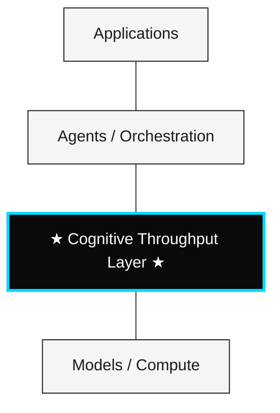

# CTI v3 — Cognitive Throughput Infrastructure

## A Measurement Protocol for Operational Cognition

**Version:** 3.0.0 &nbsp;|&nbsp; **Status:** Open Specification &nbsp;|&nbsp; **License:** CC BY 4.0

---

## Introduction

Modern artificial intelligence is benchmarked on tokens per second, latency, FLOPS, and accuracy. None of these measure what matters most for agentic and reasoning systems: **the rate and efficiency of validated decisions produced under real operational constraints.**

CTI emerges as a response to that gap.

CTI is a **measurement protocol**. It is not a theory of intelligence, a model of consciousness, or a physical law. v2 of this document used "Law/Axiom/Principle" framing inherited from physics-style manifestos. v3 explicitly removes that framing. What remains is a specification — falsifiable, revisable, and implementable.

---

## What CTI Specifies

CTI proposes a new operational layer: the **Cognitive Throughput Layer** — situated above models, tools, frameworks, and multi-agent systems.



This layer is a measurement plane. CTI specifies:

- A definition of **throughput** ($I_t$) for decision systems
- A definition of **efficiency** ($E_c$) for decision systems
- A formal model of **bounded-rational decision-making** as the underlying optimization problem
- A philosophical boundary that limits CTI to operationally observable behavior

CTI does not specify which agents, models, or runtimes implement the protocol. It specifies what they must expose to be measured.

---

## The Frame Shift

Previous versions presented CTI as a set of "Laws" — a framing borrowed from physics. This was incorrect on three counts:

1. **The two formulas are definitions, not laws.** A law makes a non-trivial prediction about the world. $I_t = \Delta D / \Delta T$ defines a rate. $E_c = Q / (C \cdot T)$ defines a quality-adjusted productivity measure. Neither predicts anything that could be falsified independently of the definition itself.
2. **Borrowing physics rhetoric weakens credibility with technical reviewers.** Calling a definition a "law" invites attack on the dressing rather than evaluation of the substance.
3. **A protocol is what AI infrastructure actually needs.** TCP/IP, HTTP, and OpenTelemetry shape ecosystems precisely because they are protocols and not theories.

v3 removes the "Law" framing entirely. The same fundamentals remain, now positioned as what they are: **a measurement specification**.

---

## Foundational Stance

CTI commits to an explicit epistemological limit:

> *"CTI measures operationally verifiable cognitive transformations, not metaphysical truth."*

CTI does not attempt to prove consciousness, define absolute intelligence, or claim to understand subjective experience. CTI specifies how to measure observable cognitive behavior within operational systems.

---

## Specification 1 — Throughput Metric

**Definition.** The throughput of a decision system is the rate of validated decisions per unit time.

$$I_t = \frac{\Delta D}{\Delta T}$$

| Variable | Definition | Unit |
|---|---|---|
| $I_t$ | Throughput | decisions / time |
| $\Delta D$ | Count of validated decisions in interval | count |
| $\Delta T$ | Interval duration | time |

**Operational consequence.** Under CTI, a system's measured cognition is the rate at which it produces decisions that pass a domain-specific validator — not the rate at which it produces outputs.

```
"Did it produce output?" → "Did it produce validated decisions, and how fast?"
```

**What CTI does not claim.** That $I_t$ is the only measure of cognition that matters, that throughput correlates with intelligence in any deep sense, or that any specific value of $I_t$ is universally good.

**What CTI does claim.** That $I_t$ is operationally definable, measurable in production, and useful for cross-system comparison once $\Delta D$ is operationalized per domain.

---

## Specification 2 — Efficiency Metric

**Definition.** The efficiency of a decision system is decision quality per unit cost per unit time.

$$E_c = \frac{Q}{C \cdot T}$$

| Variable | Definition |
|---|---|
| $E_c$ | Efficiency |
| $Q$ | Decision quality (rubric-scored or task-validated) |
| $C$ | Computational cost |
| $T$ | Latency |

**Operational consequence.** An efficient system maximizes decision quality while minimizing cost and latency. A system that produces more low-quality decisions does not improve $E_c$; a system that produces fewer high-quality decisions at low cost does.

**Relationship to $I_t$.** Specification 1 measures rate. Specification 2 measures quality-adjusted efficiency. Together they describe cognitive performance along two axes — how fast does a system decide, and how efficiently does it decide well.

---

## Formal Model of Decision

CTI models a valid decision as a contextual optimization problem under bounded rationality:

$$\underset{D}{\arg\max} \; \mathbb{E}[U(D) \mid I, C, R]$$

Subject to:

$$R_c < R_{max}$$

| Variable | Meaning |
|---|---|
| $U(D)$ | Expected contextual utility |
| $I$ | Available information |
| $C$ | Operational context |
| $R$ | Resource constraints |
| $R_c$ | Computational cost |
| $R_{max}$ | Maximum allowable cost |

This is the bounded-rationality optimization familiar from Simon (1955) and standard in constrained MDPs. CTI does not claim originality on the formal model. CTI uses it as the foundation under Specifications 1 and 2, with explicit attribution.

Optimal cognition under CTI is **not** perfect cognition. It is **adaptively efficient under constraints**.

---

## Operational Definition of a Valid Decision

CTI defines a valid decision as:

> *"A cognitive output whose causal effect advances a defined objective within an observable operational context."*

This definition is deliberately:

- **Causally grounded** — a decision with no observable effect on system state is not valid under CTI
- **Operationally observable** — a decision that cannot be logged or measured is outside scope
- **Contextual** — utility is defined relative to a stated objective, not in the abstract

> *Note: in v3.1, the primitive "decision" will be replaced by **evaluable cognitive event** with a formal type signature `{trigger, output, validator, cost, latency}`. The polysemy of "decision" is the largest semantic weakness of v3.0 and is the next item on the roadmap.*

---

## Philosophical Boundary

CTI explicitly excludes claims about consciousness, phenomenology, metaphysical intelligence, sentience, and absolute truth. CTI evaluates only observable operational behavior, measurable decision transformations, and reasoning systems under constraints.

| Domain | CTI Scope |
|---|---|
| Cognitive throughput | ✅ |
| Decision efficiency | ✅ |
| Operational validation | ✅ |
| Cognitive observability | ✅ |
| Consciousness | ❌ |
| Subjective experience | ❌ |
| Absolute truth | ❌ |

These exclusions are statements about what CTI is qualified to measure — not statements about what exists.

---

## The Conceptual Shift

**Traditional AI evaluation:**

```
input → output (correct/incorrect)
```

**Under CTI:**

```
state → cognitive transformation → contextual utility (measured operationally)
```

---

## What CTI Is Not

CTI is not a foundation model, an agent, a runtime, a prompt wrapper, a dashboard, or a benchmark suite.

## What CTI Is

- A **measurement specification** for AI decision systems
- An **open standard** governed by RFCs
- A **reference vocabulary** for cross-system comparison
- A **revisable protocol** — versioned, falsifiable, and adoption-driven

---

## Relationship to Prior Work

CTI is positioned alongside, and explicitly draws from:

- **Bounded rationality** (Simon, 1955) — the formal model is a direct application
- **Operationalism** in philosophy of science — define concepts by how they are measured
- **Rational analysis** (Anderson) — task-relative evaluation of cognition
- **AI observability infrastructure** — LangSmith, Helicone, Arize, Langfuse, AgentOps already occupy parts of the measurement plane CTI specifies; CTI proposes a vendor-neutral standard above them
- **Agent benchmarks** — AgentBench, GAIA, SWE-bench evaluate static performance; CTI is complementary, focused on runtime throughput and efficiency under real constraints

CTI does not claim originality on any of these foundations. CTI claims originality on the specific composition: a vendor-neutral protocol for runtime decision throughput and efficiency, with explicit philosophical boundaries.

---

## Open System Philosophy

CTI is an open specification, governed by RFCs. The goal is not proprietary control. The goal is to enable contribution from researchers, engineers, mathematicians, philosophers, cognitive scientists, systems architects, and open-source communities.

---

## Why This Matters

The next generation of AI systems will be evaluated less on raw capability and more on:

- Rate of useful decisions under real constraints
- Quality-adjusted cost efficiency
- Operational observability across heterogeneous stacks

CTI specifies how to measure all three.

---

## Roadmap

| Version | Focus | Status |
|---|---|---|
| v2.0.0 | "Laws" framing (deprecated) | Archived |
| **v3.0.0** | **Reframe as protocol; remove "Law" language** | **Current** |
| v3.1.0 | Replace "decision" primitive with **evaluable cognitive event** | Planned |
| v3.2.0 | Reference implementation: $I_t$, $E_c$ across agentic LLM stacks | Planned |
| v3.3.0 | One falsifiable empirical claim on $E_c$ scaling | Planned |

---

## Open Research Directions

CTI opens multiple research lines:

1. Cognitive observability standards
2. Throughput metrics under heterogeneous architectures
3. Multi-agent optimization and attribution
4. Reasoning under constraints
5. Cognitive routing
6. Operational efficiency benchmarks
7. Contextual validation methodologies
8. Adaptive decision systems

→ See [`/research/open-questions.md`](./research/open-questions.md) for the full inventory.

---

## Open Invitation

CTI is designed to evolve publicly. Researchers, engineers, mathematicians, philosophers, cognitive scientists, systems architects, and open-source contributors are invited to **question, attack, improve, and extend** this specification.

---

## Closing Statement

CTI does not claim to be a theory of intelligence. It claims to be a measurement protocol — useful, falsifiable, and revisable.

v3.0.0 removes the "Law" framing. Subsequent versions will add an operationalized primitive, a reference implementation, and at least one falsifiable empirical claim.

This is the beginning of a specification, not the end of a manifesto.

---

*CTI v3.0.0 — Licensed under [CC BY 4.0](./LICENSE)*
