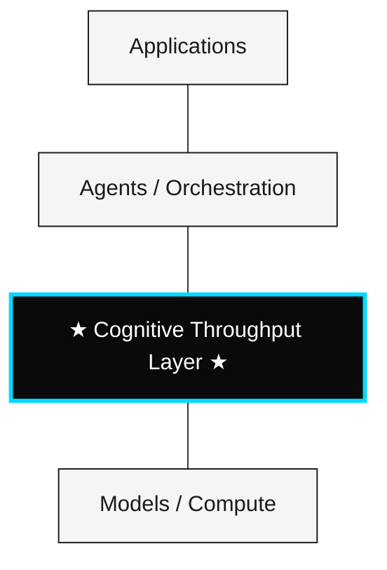

# CTI — Cognitive Throughput Infrastructure

> *A measurement protocol for operational cognition in AI systems*

---

## What CTI Is

CTI is a **measurement protocol**. It specifies how to instrument, observe, and compare AI decision systems under real constraints of cost, latency, and validation.

CTI is **not** a theory of intelligence, a model of consciousness, or a set of physical laws. v2 used "Law" framing; v3 removes it. What remains is a specification — falsifiable, revisable, and implementable.

---

## The Problem

Modern AI is benchmarked on tokens/sec, latency, FLOPS, and accuracy. None of these measure what matters most for agentic and reasoning systems: **the rate and efficiency of validated decisions produced under real operational constraints.**

CTI proposes a standard for that.

---

## The Stack

The **Cognitive Throughput Layer** is a measurement plane. It sits above models and agents and exposes telemetry: which decisions were produced, at what cost, with what observable effect. CTI specifies the interface and the metrics; it does not mandate the implementation.

---

## Specification 1 — Throughput Metric

The throughput of a decision system is defined as the rate of validated decisions per unit time.

$$I_t = \frac{\Delta D}{\Delta T}$$

| Variable | Definition | Unit |
|---|---|---|
| $I_t$ | Throughput | events / time |
| $\Delta D$ | Count of validated Evaluable Cognitive Events in interval | count |
| $\Delta T$ | Interval duration | time |

This is a **definition**, not a physical law. CTI does not claim throughput is the only meaningful measure of cognition. CTI claims throughput is **operationally measurable** when validation is specified per domain via the ECE primitive, and **useful for cross-system comparison**.

---

## Specification 2 — Efficiency Metric

The efficiency of a decision system is defined as decision quality per unit cost per unit time, computed over a set of Evaluable Cognitive Events.

For a set of ECEs $E$ in a measurement window:

$$E_c = \frac{\sum_{e \in E} Q(e)}{\sum_{e \in E} \text{cost}(e) \cdot \text{latency}(e)}$$

| Variable | Definition |
|---|---|
| $E_c$ | Efficiency |
| $Q(e)$ | Quality score of ECE $e$ (validator output, scalar form) |
| $\text{cost}(e)$ | The `cost` field of ECE $e$ |
| $\text{latency}(e)$ | The `latency` field of ECE $e$ |

The ECE primitive eliminates the v3.0 ambiguity around $Q$. Each ECE carries its own validator. CTI provides the form; the implementing system provides the rubric.

---

## Primitive — The Evaluable Cognitive Event

**New in v3.1.** The atomic unit of measurement under CTI:

$$\text{ECE} := \{\, \text{trigger}, \;\text{output}, \;\text{validator}, \;\text{cost}, \;\text{latency} \,\}$$

Every ECE carries five required fields. Specifications 1 and 2 operate directly over streams of ECEs. The primitive closes the v3.0 polysemy of "decision."

→ Full type signature (TypeScript, JSON Schema, Python) and worked examples in [`docs/primitives.md`](./docs/primitives.md).

---

## What CTI Is Complementary To

| Existing metric | What it measures | Gap CTI addresses |
|---|---|---|
| tokens/sec | Generation rate | Whether the output is a valid decision |
| latency | Time to first token | Total cost, quality |
| accuracy on benchmarks | Static task performance | Runtime cost and behavior |
| **CTI $I_t$** | Rate of validated decisions | — |
| **CTI $E_c$** | Quality-adjusted cost-efficiency | — |

CTI is a complement to existing benchmarks, not a replacement.

---

## Scope Boundary

CTI measures observable operational behavior. It makes no claims about:

| Domain | In CTI scope |
|---|---|
| Decision throughput | ✅ |
| Decision efficiency | ✅ |
| Operational validation | ✅ |
| Cognitive observability | ✅ |
| Consciousness | ❌ |
| Subjective experience | ❌ |
| Absolute truth | ❌ |

The exclusions are statements about what CTI is qualified to measure — not statements about what exists.

---

## What CTI Is Not

CTI is not a foundation model, an agent, a runtime, a prompt wrapper, a dashboard, or a benchmark suite.

## What CTI Is

- A **measurement specification** for AI decision systems
- An **open standard** governed by RFCs
- A **reference vocabulary** for cross-system comparison
- A **revisable protocol** — versioned, falsifiable, and adoption-driven

---

## Repository

| Path | Contents |
|---|---|
| [`MANIFESTO.md`](./MANIFESTO.md) | Full protocol manifesto |
| [`/docs/protocol.md`](./docs/protocol.md) | Specifications 1 & 2 in detail |
| [`/docs/primitives.md`](./docs/primitives.md) | **The Evaluable Cognitive Event — primitive type signature** |
| [`/docs/formal-model.md`](./docs/formal-model.md) | Decision optimization model |
| [`/docs/philosophy.md`](./docs/philosophy.md) | Epistemic boundaries |
| [`/rfcs/RFC-0001-template.md`](./rfcs/RFC-0001-template.md) | Proposal template |
| [`/research/open-questions.md`](./research/open-questions.md) | Open research directions |
| [`CHANGELOG.md`](./CHANGELOG.md) | Version history |
| [`CONTRIBUTING.md`](./CONTRIBUTING.md) | How to contribute |

---

## Roadmap

| Version | Focus |
|---|---|
| v3.0.0 | Reframe as protocol; remove "Law" language |
| **v3.1.0 (current)** | **Replace "decision" primitive with evaluable cognitive event** |
| v3.2.0 (planned) | Reference implementation: $I_t$ and $E_c$ computed across agentic LLM stacks |
| v3.3.0 (planned) | One falsifiable empirical claim regarding $E_c$ scaling under model size |

---

## Contributing

CTI evolves through RFCs. Submit proposals, challenges, implementations, or counter-examples.

→ See [`CONTRIBUTING.md`](./CONTRIBUTING.md).

---

## Closing Statement

CTI does not claim to be a theory of intelligence. It claims to be a measurement protocol — useful, falsifiable, revisable.

v3.0.0 retired the "Laws" framing. v3.1.0 introduces a typed primitive — the Evaluable Cognitive Event — so the protocol is now implementable, not just describable.

---

*Licensed under [CC BY 4.0](./LICENSE)*
Uploading README.md…]()
Uploading README.md…]()
