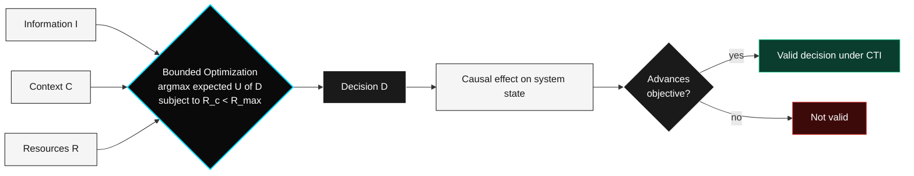

# Formal Model of Cognitive Decision

---

## Overview

CTI models a valid decision as a **contextual optimization problem under bounded rationality.**

This model is the mathematical foundation underlying both metric specifications and the operational definition of a valid decision. It is a direct application of Simon's bounded-rationality framework (1955) and is structurally familiar from constrained Markov Decision Processes (MDPs) in reinforcement learning. CTI claims no originality on the model itself; it claims correctness in adopting it as the foundation under Specifications 1 and 2.

---

## Decision Flow

A decision flows from three inputs (information, context, resources) through a bounded optimization that respects cost constraints, produces an output, and is then evaluated by its causal effect. Only decisions whose effect advances a defined objective qualify as **valid** under CTI.

---

## The Optimization Problem

A valid decision is defined as:

> *"A state-transition operator that maximizes expected contextual utility under limited constraints of information and compute."*

**Formally:**

$$\underset{D}{\arg\max} \; \mathbb{E}[U(D) \mid I, C, R]$$

**Subject to:**

$$R_c < R_{max}$$

---

## Variables

| Variable | Type | Meaning |
|----------|------|---------|
| $D$ | Decision | The cognitive output being evaluated |
| $U(D)$ | Function | Expected contextual utility of decision $D$ |
| $I$ | Context | Available information at decision time |
| $C$ | Context | Operational context (goals, environment, state) |
| $R$ | Constraint | Resource constraints (time, compute, memory) |
| $R_c$ | Scalar | Actual computational cost incurred |
| $R_{max}$ | Scalar | Maximum allowable resource cost |

---

## Key Properties

### 1. Bounded Rationality

The constraint $R_c < R_{max}$ explicitly encodes **bounded rationality**. The model assumes that no system operates with unlimited resources or perfect information.

This means:

- Optimal cognition under CTI is **not** perfect cognition
- It is **adaptively efficient** given available resources
- A decision made with limited information that maximizes $\mathbb{E}[U(D) \mid I, C, R]$ within $R_{max}$ is a **valid** decision under the protocol

### 2. Contextual Utility

$U(D)$ is **context-dependent**. Utility is not absolute. A decision is evaluated by its effect within a specific operational context $C$, not by abstract standards.

### 3. Causal Grounding

A valid decision must produce a **causal effect** that advances a defined objective. A decision with no measurable effect on system state does not qualify as valid under CTI.

---

## Operational Definition of a Valid Decision

CTI defines a valid decision as:

> *"A cognitive output whose causal effect advances a defined objective within an observable operational context."*

This definition is deliberately:

- **Free of metaphysical claims** — no appeal to absolute truth or consciousness
- **Free of domain-specific semantics** — applicable across reasoning systems, agents, and pipelines
- **Anchored to observability** — non-observable transformations are out of scope

> **Roadmap note.** In v3.1, the primitive "decision" will be replaced by **evaluable cognitive event** with a formal type signature `{trigger, output, validator, cost, latency}`. This closes the polysemy of "decision" identified in Q1.3.

---

## Relationship to the Two Specifications

The formal model underpins both metric specifications:

- **Specification 1** ($I_t = \Delta D / \Delta T$): $\Delta D$ counts decisions that satisfy $\arg\max_D \mathbb{E}[U(D) \mid I, C, R]$ within $R_c < R_{max}$
- **Specification 2** ($E_c = Q / (C \cdot T)$): $Q$ corresponds to realized $U(D)$; $C$ and $T$ correspond to $R_c$ and its temporal component

---

## Prior Art

This model is not new. It is the standard form of:

- Bounded rationality (Simon, 1955)
- Constrained MDPs in reinforcement learning
- Decision-theoretic agent models in classical AI
- Cost-aware planning in operations research

CTI's contribution is not the model. CTI's contribution is the **explicit adoption** of this model as the foundation for a vendor-neutral measurement protocol on AI decision systems.

---

## Open Questions

1. How is $U(D)$ specified across domains? (See Q2.1)
2. How is $R_{max}$ set in practice — statically, adaptively, by the operator, by the system? (See Q2.2)
3. What is the minimum information $I$ for a decision to qualify as valid? (See Q2.3)
4. How does the model extend to multi-agent settings where decisions interact? (See Q2.4)
5. Can the model be implemented as a real-time monitoring layer without measurement-induced latency? (See Q1.4 and Q3.1)

---

*Propose extensions or challenges via the [RFC process](../rfcs/RFC-0001-template.md).*
