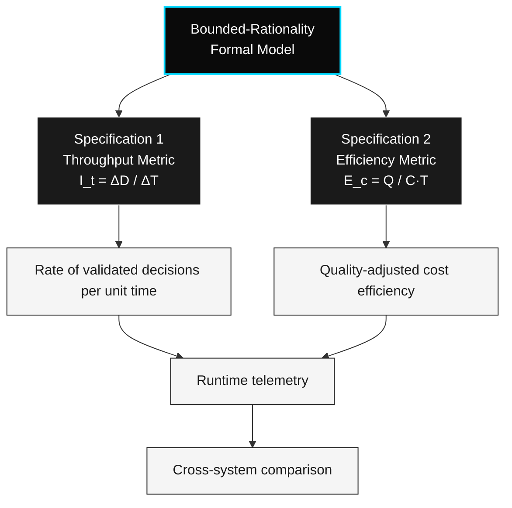

# The CTI Protocol

> *Specifications 1 & 2 — Detailed*

This document defines the two metric specifications that constitute the CTI protocol.

- **v2** used "Law" framing. **v3.0** removed it.
- **v3.1** revises the metrics to operate over the formal primitive defined in [`primitives.md`](./primitives.md) — the **Evaluable Cognitive Event (ECE)**. Read that document first; the specifications below assume it.

---

## Overview



Both specifications inherit from the same bounded-rationality formal model. They expose different axes of the same operational reality: $I_t$ measures rate, $E_c$ measures quality-adjusted efficiency. Together they enable runtime telemetry and cross-system comparison.

---

## Specification 1 — Throughput Metric

### Statement

The throughput of a decision system is defined as the rate of validated Evaluable Cognitive Events per unit time.

### Formal Expression

$$I_t = \frac{\Delta D}{\Delta T}$$

Where:

$$\Delta D = \left| \{\, e \in \text{ECE}_{[t,\; t+\Delta T]} \;:\; \text{validator}(e) \text{ truthy} \,\} \right|$$

| Variable | Definition | Unit |
|----------|-----------|------|
| $I_t$ | Throughput | events / time |
| $\Delta D$ | Count of ECEs in the window whose `validator` returned a truthy score | count |
| $\Delta T$ | Interval duration | time |

> An ECE is "truthy-validated" when its `validator(trigger, output)` returns `true` (boolean form), a non-zero score (scalar form), or a non-empty score vector (vector form). See [`primitives.md`](./primitives.md) for the three canonical validator forms.

### Interpretation

Under CTI, the operational measurement of a system's cognition is the rate at which it produces ECEs that pass their attached `validator` — not the rate at which it produces outputs.

This shifts measurement from:

```
"Did it produce output?" → "Did it produce validated cognitive events, and how fast?"
```

### Key Properties

- $\Delta D$ counts **validated** ECEs only — events whose validator returned a falsy score do not contribute.
- Validation is **part of the event itself** (the `validator` field) rather than an external judgment applied after the fact. This eliminates the v3.0 ambiguity around "who decides what counts as validation."
- $I_t$ is a **rate**, not an absolute count. Comparing $I_t$ across systems requires matching $\Delta T$ and validator definitions.

### What This Specification Does Not Claim

- That $I_t$ is the only meaningful measure of a system's cognition
- That higher $I_t$ implies "more intelligent" in any deep sense
- That throughput is the right measure for every domain

### What This Specification Does Claim

- That $I_t$ is operationally definable
- That $I_t$ is measurable in production with reasonable instrumentation
- That $I_t$ is useful for **cross-system comparison** once $\Delta D$ is operationalized

### Open Questions

- How is "validation" operationalized across domains? (See Q1.1 in open-questions.md)
- ~~What is the baseline unit of a "decision"?~~ **Closed in v3.1.** See [`primitives.md`](./primitives.md).
- Can $I_t$ be measured in real-time systems without prohibitive overhead? (See Q1.4)

---

## Specification 2 — Efficiency Metric

### Statement

The efficiency of a decision system is defined as decision quality per unit cost per unit time, computed over a set of Evaluable Cognitive Events.

### Formal Expression

For a set of ECEs $E = \{e_1, e_2, \ldots, e_n\}$ in a measurement window:

$$E_c = \frac{\sum_{e \in E} Q(e)}{\sum_{e \in E} \text{cost}(e) \cdot \text{latency}(e)}$$

| Variable | Definition |
|----------|-----------|
| $E_c$ | Efficiency |
| $Q(e)$ | Quality score of ECE $e$, returned by its `validator` (scalar form) |
| $\text{cost}(e)$ | The `cost` field of ECE $e$ |
| $\text{latency}(e)$ | The `latency` field of ECE $e$ |

> Both $\text{cost}$ and $\text{latency}$ are **fields of the ECE itself**. They are not derived externally. This makes $E_c$ directly computable from any well-formed sequence of ECEs.

For boolean-validator ECEs, $Q(e) \in \{0, 1\}$. For vector-validator ECEs, $Q(e)$ is an aggregation function over the score vector — defined per implementation.

### Interpretation

Specification 2 introduces **efficiency** as a complement to throughput. The optimal system under CTI is one that maximizes decision quality while minimizing cost and latency — not one that simply maximizes output volume.

Key implications:

- Higher $Q$ **increases** $E_c$
- Higher $C$ (cost) **decreases** $E_c$
- Higher $T$ (latency) **decreases** $E_c$

### Relationship to Specification 1

Specification 1 measures **rate** ($I_t$).
Specification 2 measures **quality-adjusted efficiency** ($E_c$).

Together they describe a system's cognitive performance along two axes:

- *How fast does it produce validated decisions?* ($I_t$)
- *How efficiently does it produce them well?* ($E_c$)

### Operationalization Requirements

A system claiming CTI compliance must emit ECEs (see [`primitives.md`](./primitives.md)) with all five required fields populated. The protocol's measurement layer derives $I_t$ and $E_c$ directly from the stream of ECEs:

| Metric input | Source |
|----------|--------------------|
| $\Delta D$ | Count of ECEs in window where `validator(e)` is truthy |
| $\Delta T$ | Window duration |
| $Q(e)$ | Validator score of ECE $e$ (scalar form) |
| $\text{cost}(e)$ | `cost` field of ECE $e$ |
| $\text{latency}(e)$ | `latency` field of ECE $e$ |

The protocol specifies the form. The implementing system specifies the validator and the cost/latency units.

### Open Questions

- How is $Q$ measured formally without circular definitions? Partially addressed by the `validator` field of the ECE primitive (see [`primitives.md`](./primitives.md)) — the validator is now a first-class typed function. Domain-specific rubrics remain open (Q1.2).
- What is the relationship between $E_c$ and energy efficiency in physical hardware?
- Can $I_t$ and $E_c$ be combined into a single composite score, and should they be?

---

## On Naming

Earlier versions named these specifications "First Law" and "Second Law" by analogy to physics. This framing has been retired:

- A **law** makes a non-trivial prediction about the world. These expressions do not — they define names for ratios.
- A **definition** specifies a measurable quantity. These expressions are definitions.
- A **protocol** is a vendor-neutral standard for measurement. CTI is a protocol.

The retraction does not weaken the specifications. It correctly positions them.

---

## Related Documents

- See [`primitives.md`](./primitives.md) for the **Evaluable Cognitive Event** type signature underlying both specifications.
- See [`formal-model.md`](./formal-model.md) for the bounded-rationality optimization that underlies both specifications.
- See [`philosophy.md`](./philosophy.md) for the epistemological boundaries of CTI.
- See [`/research/open-questions.md`](../research/open-questions.md) for the full inventory of unresolved questions.

---

*Propose extensions or challenges via the [RFC process](../rfcs/RFC-0001-template.md).*
ploading protocol.md…]()
