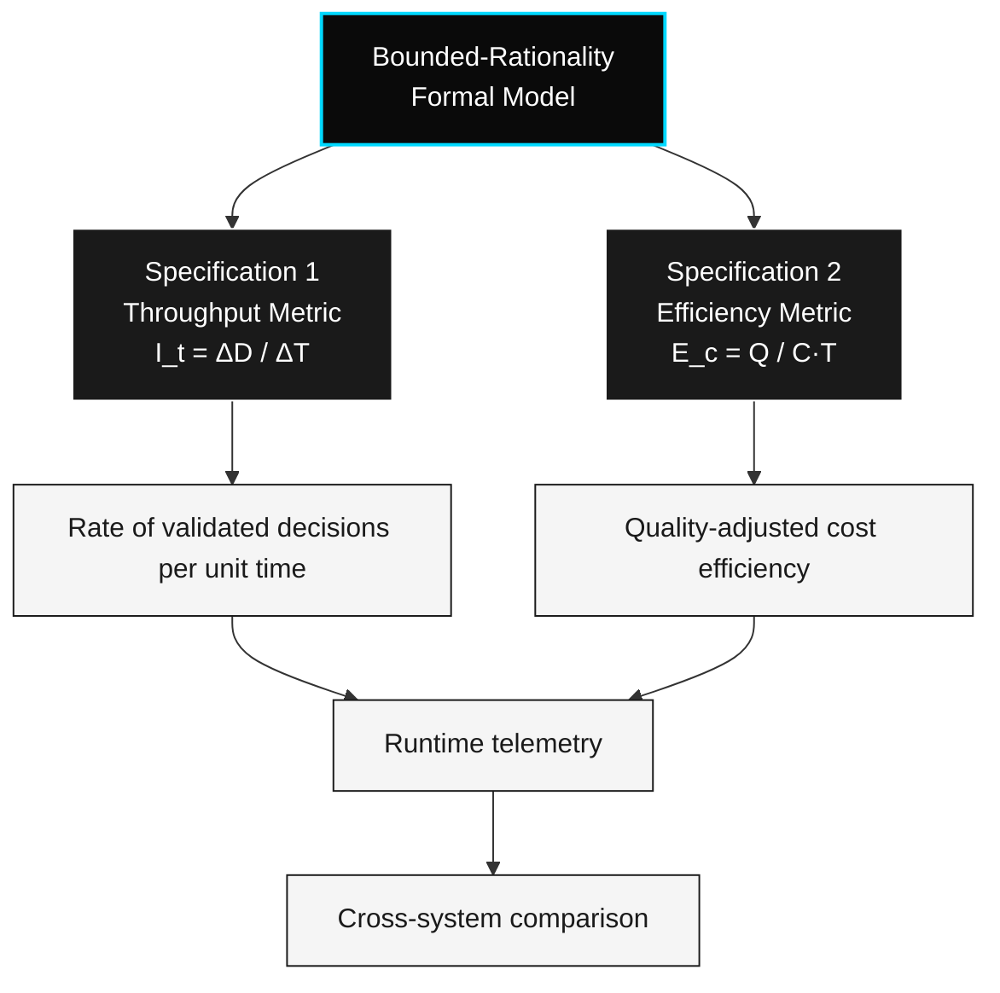

# The CTI Protocol

> *Specifications 1 & 2 — Detailed*

This document defines the two metric specifications that constitute the CTI protocol. v2 of this document used "Law" framing; v3 removes it. The metrics are unchanged; the positioning is corrected.

---

## Overview



Both specifications inherit from the same bounded-rationality formal model. They expose different axes of the same operational reality: $I_t$ measures rate, $E_c$ measures quality-adjusted efficiency. Together they enable runtime telemetry and cross-system comparison.

---

## Specification 1 — Throughput Metric

### Statement

The throughput of a decision system is defined as the rate of validated decisions per unit time.

### Formal Expression

$$I_t = \frac{\Delta D}{\Delta T}$$

| Variable | Definition | Unit |
|----------|-----------|------|
| $I_t$ | Throughput | decisions / time |
| $\Delta D$ | Count of validated decisions in interval | count |
| $\Delta T$ | Interval duration | time |

### Interpretation

Under CTI, the operational measurement of a system's cognition is the rate at which it produces decisions that pass a domain-specific validator — not the rate at which it produces outputs.

This shifts measurement from:

```
"Did it produce output?" → "Did it produce validated decisions, and how fast?"
```

### Key Properties

- $\Delta D$ counts **validated** decisions only — outputs that do not pass validation do not contribute.
- Validation is **context-dependent** and **operationally defined**. The protocol does not specify a universal validator; it specifies that one must exist per measurement context.
- $I_t$ is a **rate**, not an absolute count. Comparing $I_t$ across systems requires matching $\Delta T$ and validation criteria.

### What This Specification Does Not Claim

- That $I_t$ is the only meaningful measure of a system's cognition
- That higher $I_t$ implies "more intelligent" in any deep sense
- That throughput is the right measure for every domain

### What This Specification Does Claim

- That $I_t$ is operationally definable
- That $I_t$ is measurable in production with reasonable instrumentation
- That $I_t$ is useful for **cross-system comparison** once $\Delta D$ is operationalized

### Open Questions

- How is "validation" operationalized across domains? (See Q1.1 in open-questions.md)
- What is the baseline unit of a "decision"? (See Q1.3; addressed in v3.1 via the **evaluable cognitive event** primitive)
- Can $I_t$ be measured in real-time systems without prohibitive overhead? (See Q1.4)

---

## Specification 2 — Efficiency Metric

### Statement

The efficiency of a decision system is defined as decision quality per unit cost per unit time.

### Formal Expression

$$E_c = \frac{Q}{C \cdot T}$$

| Variable | Definition |
|----------|-----------|
| $E_c$ | Efficiency |
| $Q$ | Decision quality (rubric-scored or task-validated) |
| $C$ | Computational cost |
| $T$ | Latency |

### Interpretation

Specification 2 introduces **efficiency** as a complement to throughput. The optimal system under CTI is one that maximizes decision quality while minimizing cost and latency — not one that simply maximizes output volume.

Key implications:

- Higher $Q$ **increases** $E_c$
- Higher $C$ (cost) **decreases** $E_c$
- Higher $T$ (latency) **decreases** $E_c$

### Relationship to Specification 1

Specification 1 measures **rate** ($I_t$).
Specification 2 measures **quality-adjusted efficiency** ($E_c$).

Together they describe a system's cognitive performance along two axes:

- *How fast does it produce validated decisions?* ($I_t$)
- *How efficiently does it produce them well?* ($E_c$)

### Operationalization Requirements

A system claiming CTI compliance must expose:

| Variable | Required telemetry |
|----------|--------------------|
| $\Delta D$ | Counter of validated decisions per measurement window |
| $\Delta T$ | Window duration |
| $Q$ | Per-decision quality score, produced by a stated validator or rubric |
| $C$ | Per-decision computational cost (tokens, compute time, monetary cost, or composite) |
| $T$ | Per-decision latency |

The protocol specifies the form. The implementing system specifies the rubric and the validator.

### Open Questions

- How is $Q$ measured formally without circular definitions? (See Q1.2)
- What is the relationship between $E_c$ and energy efficiency in physical hardware?
- Can $I_t$ and $E_c$ be combined into a single composite score, and should they be?

---

## On Naming

Earlier versions named these specifications "First Law" and "Second Law" by analogy to physics. This framing has been retired:

- A **law** makes a non-trivial prediction about the world. These expressions do not — they define names for ratios.
- A **definition** specifies a measurable quantity. These expressions are definitions.
- A **protocol** is a vendor-neutral standard for measurement. CTI is a protocol.

The retraction does not weaken the specifications. It correctly positions them.

---

## Related Documents

- See [`formal-model.md`](./formal-model.md) for the bounded-rationality optimization that underlies both specifications.
- See [`philosophy.md`](./philosophy.md) for the epistemological boundaries of CTI.
- See [`/research/open-questions.md`](../research/open-questions.md) for the full inventory of unresolved questions.

---

*Propose extensions or challenges via the [RFC process](../rfcs/RFC-0001-template.md).*
